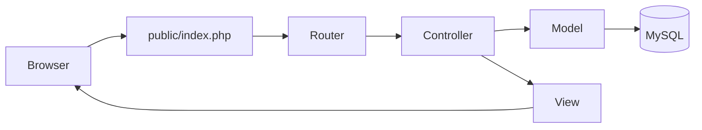
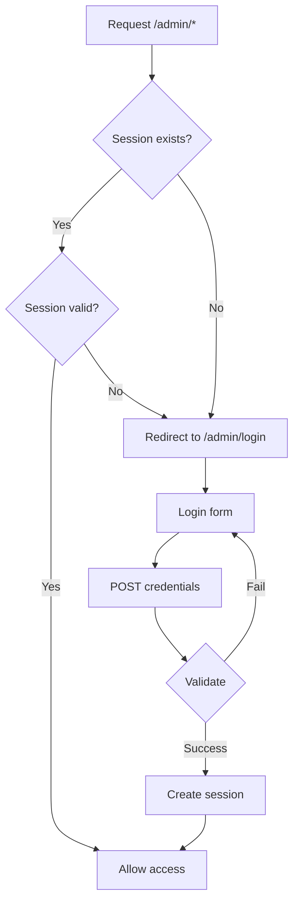
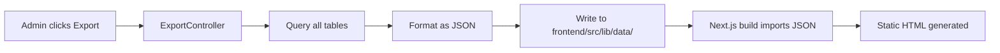
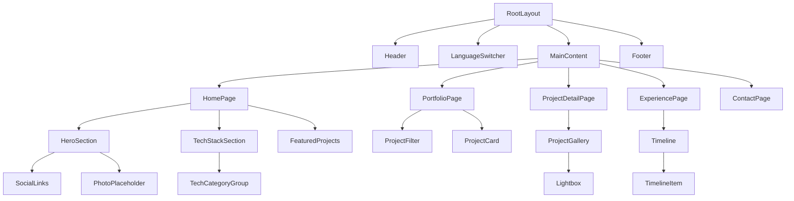
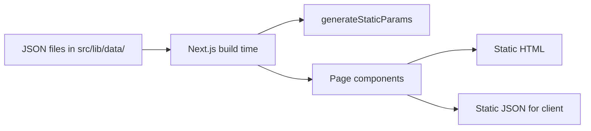
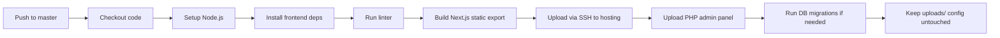

# Portfolio Website Redesign — Architectural Plan

## 1. Sitemap & URL Structure

### Public Website (Next.js Static Export)

```
/                                   → Home page (redirect to /ru or /en based on Accept-Language)
/ru                                 → Home page (Russian)
/en                                 → Home page (English)
/ru/portfolio                       → Portfolio grid (Russian)
/en/portfolio                       → Portfolio grid (English)
/ru/portfolio/[slug]                → Project detail page (Russian)
/en/portfolio/[slug]                → Project detail page (English)
/ru/experience                      → Experience timeline (Russian)
/en/experience                      → Experience timeline (English)
/ru/contact                         → Contact page (Russian)
/en/contact                         → Contact page (English)
```

**Static files generated by Next.js:**

```
/sitemap.xml
/robots.txt
/favicon.ico
/favicon/*
```

### Admin Panel (PHP)

```
/admin/                             → Login page (redirect if not authenticated)
/admin/login                        → Authentication form
/admin/logout                       → Logout action
/admin/dashboard                    → Dashboard with stats
/admin/projects                     → Project list (CRUD)
/admin/projects/create              → Create project
/admin/projects/edit/{id}           → Edit project
/admin/projects/delete/{id}         → Delete project
/admin/projects/{id}/screenshots    → Screenshot management for project
/admin/technologies                 → Technology list (CRUD)
/admin/technologies/create          → Create technology
/admin/technologies/edit/{id}       → Edit technology
/admin/technologies/delete/{id}     → Delete technology
/admin/experience                   → Experience list (CRUD)
/admin/experience/create            → Create experience entry
/admin/experience/edit/{id}         → Edit experience entry
/admin/experience/delete/{id}       → Delete experience entry
/admin/profile                      → Edit profile info (name, bio, photo, social links)
/admin/export                       → Export all data to JSON files
```

---

## 2. Database Schema

```sql
-- ============================================
-- Table: profile
-- Stores personal information (single row)
-- ============================================
CREATE TABLE profile (
    id              INT PRIMARY KEY AUTO_INCREMENT,
    name_ru         VARCHAR(255) NOT NULL,
    name_en         VARCHAR(255) NOT NULL,
    position_ru     VARCHAR(255) NOT NULL,
    position_en     VARCHAR(255) NOT NULL,
    summary_ru      TEXT NOT NULL,
    summary_en      TEXT NOT NULL,
    photo           VARCHAR(255) DEFAULT NULL,
    email           VARCHAR(255) NOT NULL,
    github_url      VARCHAR(255) DEFAULT NULL,
    linkedin_url    VARCHAR(255) DEFAULT NULL,
    telegram_url    VARCHAR(255) DEFAULT NULL,
    resume_file     VARCHAR(255) DEFAULT NULL,
    created_at      TIMESTAMP DEFAULT CURRENT_TIMESTAMP,
    updated_at      TIMESTAMP DEFAULT CURRENT_TIMESTAMP ON UPDATE CURRENT_TIMESTAMP
);

-- ============================================
-- Table: technologies
-- Stores technology stack items
-- ============================================
CREATE TABLE technologies (
    id              INT PRIMARY KEY AUTO_INCREMENT,
    name            VARCHAR(100) NOT NULL,
    category        ENUM('frontend', 'backend', 'tools', 'other') NOT NULL,
    icon            VARCHAR(255) DEFAULT NULL,
    sort_order      INT DEFAULT 0,
    created_at      TIMESTAMP DEFAULT CURRENT_TIMESTAMP,
    updated_at      TIMESTAMP DEFAULT CURRENT_TIMESTAMP ON UPDATE CURRENT_TIMESTAMP
);

-- ============================================
-- Table: experience
-- Stores work experience entries
-- ============================================
CREATE TABLE experience (
    id              INT PRIMARY KEY AUTO_INCREMENT,
    company_ru      VARCHAR(255) NOT NULL,
    company_en      VARCHAR(255) NOT NULL,
    position_ru     VARCHAR(255) NOT NULL,
    position_en     VARCHAR(255) NOT NULL,
    description_ru  TEXT DEFAULT NULL,
    description_en  TEXT DEFAULT NULL,
    start_date      DATE NOT NULL,
    end_date        DATE DEFAULT NULL,  -- NULL means "Present"
    sort_order      INT DEFAULT 0,
    created_at      TIMESTAMP DEFAULT CURRENT_TIMESTAMP,
    updated_at      TIMESTAMP DEFAULT CURRENT_TIMESTAMP ON UPDATE CURRENT_TIMESTAMP
);

-- ============================================
-- Table: projects
-- Stores portfolio projects
-- ============================================
CREATE TABLE projects (
    id                  INT PRIMARY KEY AUTO_INCREMENT,
    slug_ru             VARCHAR(255) NOT NULL UNIQUE,
    slug_en             VARCHAR(255) NOT NULL UNIQUE,
    title_ru            VARCHAR(255) NOT NULL,
    title_en            VARCHAR(255) NOT NULL,
    short_description_ru TEXT DEFAULT NULL,
    short_description_en TEXT DEFAULT NULL,
    full_description_ru  TEXT DEFAULT NULL,
    full_description_en  TEXT DEFAULT NULL,
    role_ru             VARCHAR(255) DEFAULT NULL,
    role_en             VARCHAR(255) DEFAULT NULL,
    responsibilities_ru  TEXT DEFAULT NULL,
    responsibilities_en  TEXT DEFAULT NULL,
    external_url        VARCHAR(255) DEFAULT NULL,
    featured            BOOLEAN DEFAULT FALSE,
    status              ENUM('active', 'archived', 'completed') DEFAULT 'completed',
    sort_order          INT DEFAULT 0,
    created_at          TIMESTAMP DEFAULT CURRENT_TIMESTAMP,
    updated_at          TIMESTAMP DEFAULT CURRENT_TIMESTAMP ON UPDATE CURRENT_TIMESTAMP
);

-- ============================================
-- Table: project_technologies
-- Many-to-many relationship between projects and technologies
-- ============================================
CREATE TABLE project_technologies (
    project_id      INT NOT NULL,
    technology_id   INT NOT NULL,
    PRIMARY KEY (project_id, technology_id),
    FOREIGN KEY (project_id) REFERENCES projects(id) ON DELETE CASCADE,
    FOREIGN KEY (technology_id) REFERENCES technologies(id) ON DELETE CASCADE
);

-- ============================================
-- Table: project_screenshots
-- Stores screenshots for projects
-- ============================================
CREATE TABLE project_screenshots (
    id              INT PRIMARY KEY AUTO_INCREMENT,
    project_id      INT NOT NULL,
    filename        VARCHAR(255) NOT NULL,
    thumbnail       VARCHAR(255) NOT NULL,
    title_ru        VARCHAR(255) DEFAULT NULL,
    title_en        VARCHAR(255) DEFAULT NULL,
    sort_order      INT DEFAULT 0,
    created_at      TIMESTAMP DEFAULT CURRENT_TIMESTAMP,
    FOREIGN KEY (project_id) REFERENCES projects(id) ON DELETE CASCADE
);

-- ============================================
-- Table: admin_users
-- Stores admin credentials
-- ============================================
CREATE TABLE admin_users (
    id              INT PRIMARY KEY AUTO_INCREMENT,
    username        VARCHAR(100) NOT NULL UNIQUE,
    password_hash   VARCHAR(255) NOT NULL,
    created_at      TIMESTAMP DEFAULT CURRENT_TIMESTAMP
);
```

### Entity Relationship Diagram

```mermaid
erDiagram
    profile ||--o{ } : has-one-row
    admin_users ||--o{ } : has-one-or-more

    projects ||--o{ project_screenshots : has
    projects ||--o{ project_technologies : has
    technologies ||--o{ project_technologies : belongs-to

    projects {
        int id PK
        varchar slug_ru
        varchar slug_en
        varchar title_ru
        varchar title_en
        text short_description_ru
        text short_description_en
        text full_description_ru
        text full_description_en
        varchar role_ru
        varchar role_en
        text responsibilities_ru
        text responsibilities_en
        varchar external_url
        boolean featured
        enum status
        int sort_order
    }

    project_screenshots {
        int id PK
        int project_id FK
        varchar filename
        varchar thumbnail
        varchar title_ru
        varchar title_en
        int sort_order
    }

    technologies {
        int id PK
        varchar name
        enum category
        varchar icon
        int sort_order
    }

    project_technologies {
        int project_id FK
        int technology_id FK
    }

    experience {
        int id PK
        varchar company_ru
        varchar company_en
        varchar position_ru
        varchar position_en
        text description_ru
        text description_en
        date start_date
        date end_date
        int sort_order
    }

    profile {
        int id PK
        varchar name_ru
        varchar name_en
        varchar position_ru
        varchar position_en
        text summary_ru
        text summary_en
        varchar photo
        varchar email
        varchar github_url
        varchar linkedin_url
        varchar telegram_url
        varchar resume_file
    }

    admin_users {
        int id PK
        varchar username
        varchar password_hash
    }
```

---

## 3. Folder Structure (Monorepo)

```
/
├── frontend/                          # Next.js static site
│   ├── public/
│   │   ├── favicon/
│   │   ├── images/
│   │   ├── screenshots/
│   │   ├── resume/
│   │   ├── sitemap.xml                # Generated at build
│   │   ├── robots.txt                 # Generated at build
│   │   └── manifest.json
│   ├── src/
│   │   ├── app/
│   │   │   ├── [lang]/
│   │   │   │   ├── page.tsx           # Home page
│   │   │   │   ├── portfolio/
│   │   │   │   │   ├── page.tsx       # Portfolio grid
│   │   │   │   │   └── [slug]/
│   │   │   │   │       └── page.tsx   # Project detail
│   │   │   │   ├── experience/
│   │   │   │   │   └── page.tsx       # Experience timeline
│   │   │   │   └── contact/
│   │   │   │       └── page.tsx       # Contact page
│   │   │   ├── layout.tsx             # Root layout
│   │   │   └── not-found.tsx          # 404 page
│   │   ├── components/
│   │   │   ├── ui/                    # shadcn/ui components
│   │   │   ├── layout/
│   │   │   │   ├── Header.tsx
│   │   │   │   ├── Footer.tsx
│   │   │   │   ├── Navigation.tsx
│   │   │   │   └── LanguageSwitcher.tsx
│   │   │   ├── home/
│   │   │   │   ├── HeroSection.tsx
│   │   │   │   ├── TechStackSection.tsx
│   │   │   │   └── FeaturedProjects.tsx
│   │   │   ├── portfolio/
│   │   │   │   ├── ProjectCard.tsx
│   │   │   │   ├── ProjectFilter.tsx
│   │   │   │   └── ProjectGallery.tsx
│   │   │   ├── experience/
│   │   │   │   └── Timeline.tsx
│   │   │   └── shared/
│   │   │       ├── Lightbox.tsx
│   │   │       ├── SectionHeading.tsx
│   │   │       └── SocialLinks.tsx
│   │   ├── lib/
│   │   │   ├── data/                  # JSON data files (imported at build)
│   │   │   │   ├── profile.json
│   │   │   │   ├── projects.json
│   │   │   │   ├── technologies.json
│   │   │   │   └── experience.json
│   │   │   ├── i18n/
│   │   │   │   ├── dictionaries/
│   │   │   │   │   ├── ru.json
│   │   │   │   │   └── en.json
│   │   │   │   └── index.ts
│   │   │   ├── utils.ts
│   │   │   └── types.ts
│   │   └── hooks/
│   │       └── useLocale.ts
│   ├── next.config.ts
│   ├── tailwind.config.ts
│   ├── tsconfig.json
│   ├── components.json               # shadcn/ui config
│   └── package.json
│
├── admin/                             # PHP admin panel
│   ├── public/
│   │   ├── index.php                  # Entry point (front controller)
│   │   ├── .htaccess                  # URL rewriting
│   │   ├── assets/
│   │   │   ├── css/
│   │   │   ├── js/
│   │   │   └── images/
│   │   └── uploads/
│   │       ├── screenshots/
│   │       ├── thumbnails/
│   │       └── resume/
│   ├── src/
│   │   ├── Config/
│   │   │   └── Database.php
│   │   ├── Core/
│   │   │   ├── Router.php
│   │   │   ├── Controller.php
│   │   │   ├── Model.php
│   │   │   ├── View.php
│   │   │   ├── Request.php
│   │   │   ├── Session.php
│   │   │   └── Auth.php
│   │   ├── Controllers/
│   │   │   ├── AuthController.php
│   │   │   ├── DashboardController.php
│   │   │   ├── ProjectController.php
│   │   │   ├── ScreenshotController.php
│   │   │   ├── TechnologyController.php
│   │   │   ├── ExperienceController.php
│   │   │   ├── ProfileController.php
│   │   │   └── ExportController.php
│   │   ├── Models/
│   │   │   ├── Project.php
│   │   │   ├── Technology.php
│   │   │   ├── Experience.php
│   │   │   ├── Profile.php
│   │   │   └── AdminUser.php
│   │   ├── Views/
│   │   │   ├── layouts/
│   │   │   │   ├── default.php
│   │   │   │   └── login.php
│   │   │   ├── auth/
│   │   │   │   └── login.php
│   │   │   ├── dashboard/
│   │   │   │   └── index.php
│   │   │   ├── projects/
│   │   │   │   ├── index.php
│   │   │   │   ├── create.php
│   │   │   │   ├── edit.php
│   │   │   │   └── screenshots.php
│   │   │   ├── technologies/
│   │   │   │   ├── index.php
│   │   │   │   ├── create.php
│   │   │   │   └── edit.php
│   │   │   ├── experience/
│   │   │   │   ├── index.php
│   │   │   │   ├── create.php
│   │   │   │   └── edit.php
│   │   │   └── profile/
│   │   │       └── edit.php
│   │   └── Helpers/
│   │       ├── ImageHelper.php
│   │       └── ValidationHelper.php
│   ├── migrations/
│   │   └── 001_initial_schema.sql
│   ├── config.php                    # Database credentials, app config
│   └── install.php                   # First-run setup
│
├── scripts/                           # Build & deployment scripts
│   ├── export-json.php               # PHP script to export DB to JSON
│   ├── generate-pdf.php              # PHP script to generate resume PDF
│   └── deploy.sh                     # Deployment script
│
├── .github/
│   └── workflows/
│       └── deploy.yml                # GitHub Actions workflow
│
├── .gitignore
└── README.md
```

---

## 4. Admin Panel Architecture (MVC)

### Request Flow



### Routing

The admin panel uses a lightweight front controller pattern:

- All requests go through `public/index.php`
- `.htaccess` rewrites all `/admin/*` requests to `public/index.php`
- `Router.php` parses the URI and dispatches to the appropriate controller method
- Routes are defined as: `METHOD /path -> Controller@action`

### Authentication Flow



### Security Measures

- Passwords hashed with `password_hash()` (bcrypt)
- Session-based auth with `session_regenerate_id()` on login
- CSRF protection via tokens on all forms
- Input sanitization with `htmlspecialchars()` on output
- Prepared statements for all SQL queries (PDO)
- File upload validation (type, size, extension)
- Thumbnail generation with GD library

### JSON Export Flow



---

## 5. Next.js Frontend Architecture

### Component Tree



### Data Flow



### Key Technical Decisions

1. **Static Export (`output: 'export'`)** — Next.js generates pure HTML/CSS/JS. No Node.js runtime needed on the server.

2. **`generateStaticParams()`** — All portfolio project pages are pre-generated at build time based on the JSON data.

3. **Locale handling** — URL-based localization (`/ru/...`, `/en/...`). A simple dictionary-based i18n system without heavy libraries.

4. **Client components** — Only interactive elements (Lightbox, ProjectFilter, LanguageSwitcher) use `'use client'`. Everything else is a Server Component.

5. **Image optimization** — Since static export doesn't support Next.js Image Optimization, we use `` tags with pre-generated responsive images, or `next/image` with `unoptimized` prop.

6. **shadcn/ui** — Used for UI primitives (Button, Card, Dialog, Badge, etc.). Only the components we actually use are installed.

---

## 6. Design System

### Typography

- **Headings**: Inter (sans-serif, geometric, premium feel)
- **Body**: Inter or system font stack
- **Monospace**: JetBrains Mono (for code snippets if needed)

### Color Palette

```
Light mode:
  Background: #FFFFFF
  Surface:    #F5F5F7 (Apple-like light gray)
  Text:       #1D1D1F
  Accent:     #0071E3 (Apple blue)
  Border:     #D2D2D7

Dark mode:
  Background: #000000
  Surface:    #1C1C1E
  Text:       #F5F5F7
  Accent:     #2997FF
  Border:     #424245
```

### Spacing Scale

Based on 8px grid: 8, 16, 24, 32, 48, 64, 80, 96, 128

### Animations

- Subtle fade-in on scroll (Intersection Observer)
- Smooth hover transitions on cards (scale: 1.02, shadow increase)
- Page transitions (simple fade)
- No parallax, no particle effects, no neon

---

## 7. Wireframes (Text-Based)

### Home Page Layout

```
┌─────────────────────────────────────────────┐
│  [Logo]  [Portfolio] [Experience] [Contact]  │  ← Header (sticky)
│                          [RU] [EN]           │
├─────────────────────────────────────────────┤
│                                             │
│  ┌──────────┐                               │
│  │  Photo   │  Mikhail Zakharov             │  ← Hero Section
│  │  Place-  │  Senior Frontend Developer    │
│  │  holder  │  with 15+ years of experience │
│  │          │                               │
│  │          │  [View Portfolio] [Resume]    │
│  │          │  [GitHub] [LinkedIn] [TG]     │
│  └──────────┘                               │
│                                             │
├─────────────────────────────────────────────┤
│  Focus Areas                                │
│  ┌──────┐ ┌──────┐ ┌──────┐ ┌──────┐       │  ← Tech Focus Badges
│  │React │ │Type- │ │Front │ │E-com │       │
│  │      │ │script│ │Arch  │ │merce │       │
│  └──────┘ └──────┘ └──────┘ └──────┘       │
│                                             │
├─────────────────────────────────────────────┤
│  Featured Projects                          │
│  ┌──────────────┐ ┌──────────────┐          │  ← Project Cards Grid
│  │  Project 1   │ │  Project 2   │          │
│  │  [img]       │ │  [img]       │          │
│  │  Title       │ │  Title       │          │
│  │  Description │ │  Description │          │
│  │  Tech badges │ │  Tech badges │          │
│  └──────────────┘ └──────────────┘          │
│                                             │
├─────────────────────────────────────────────┤
│  Technology Stack                           │
│  Frontend:  React Next.js TypeScript ...    │  ← Grouped Tech
│  Backend:   PHP Node.js MySQL               │
│  Tools:     Git Docker GitHub Actions ...   │
│                                             │
├─────────────────────────────────────────────┤
│  Experience Timeline                        │
│                                              │
│  2024 ─── Company ── Position ── Desc       │  ← Timeline
│  2022 ─── Company ── Position ── Desc       │
│  2020 ─── Company ── Position ── Desc       │
│                                             │
├─────────────────────────────────────────────┤
│  © 2026 Mikhail Zakharov                    │  ← Footer
│  [GitHub] [LinkedIn] [Telegram] [Email]     │
└─────────────────────────────────────────────┘
```

### Portfolio Page Layout

```
┌─────────────────────────────────────────────┐
│  Portfolio                              [RU]│
│                                             │
│  [All] [React] [Vue] [PHP] [TypeScript...]  │  ← Filter Chips
│                                             │
│  ┌──────┐ ┌──────┐ ┌──────┐ ┌──────┐       │
│  │Card 1│ │Card 2│ │Card 3│ │Card 4│       │  ← Project Grid
│  └──────┘ └──────┘ └──────┘ └──────┘       │
│  ┌──────┐ ┌──────┐ ┌──────┐ ┌──────┐       │
│  │Card 5│ │Card 6│ │Card 7│ │Card 8│       │
│  └──────┘ └──────┘ └──────┘ └──────┘       │
└─────────────────────────────────────────────┘
```

### Project Detail Page Layout

```
┌─────────────────────────────────────────────┐
│  ← Back to Portfolio                   [RU] │
│                                             │
│  Project Title                              │
│  ┌─────────────────────────────────────┐    │
│  │                                     │    │
│  │         Screenshot Gallery          │    │  ← Gallery with lightbox
│  │         (carousel/grid)             │    │
│  │                                     │    │
│  └─────────────────────────────────────┘    │
│                                             │
│  Description                                │
│  ───────────────────────────────────────    │
│  Full project description text here...      │
│                                             │
│  Role: Frontend Developer                   │
│  Status: Completed                          │
│  URL: example.com                           │
│                                             │
│  Technologies: [React] [TypeScript] [Vue]   │
│                                             │
│  Responsibilities:                          │
│  • Responsibility 1                         │
│  • Responsibility 2                         │
│  • Responsibility 3                         │
└─────────────────────────────────────────────┘
```

---

## 8. SEO Implementation

### Per-Page Meta

Each page will have dynamically generated meta tags:

- `<title>` — Translated per locale
- `<meta name="description">` — Translated per locale
- `<meta property="og:title">` — Translated per locale
- `<meta property="og:description">` — Translated per locale
- `<meta property="og:image">` — Project screenshot or profile photo
- `<meta property="og:url">` — Canonical URL
- `<meta name="twitter:card">` — summary_large_image

### Structured Data (JSON-LD)

- **Person** schema for the home page (name, jobTitle, sameAs URLs)
- **ItemList** schema for portfolio page
- **SoftwareApplication** or **CreativeWork** schema for each project
- **BreadcrumbList** schema for navigation

### Sitemap Generation

`sitemap.xml` will be generated at build time in `next.config.ts` using the JSON data files to list all project URLs in both locales.

---

## 9. GitHub Actions Deployment



### Deployment Strategy

- **SSH into shared hosting** using `sshpass` or SSH keys
- **Rsync** only changed files to the server
- **Exclude** `uploads/` directory and `config.php` from overwrite
- **Run `composer install`** on the server if dependencies change (or commit vendor folder for simplicity)

---

## 10. Implementation Order

The implementation should proceed in this order:

| Phase | Tasks | Dependencies |
|-------|-------|-------------|
| **Phase 1: Foundation** | Set up monorepo structure, Next.js with Tailwind, shadcn/ui, PHP admin skeleton, database migrations | None |
| **Phase 2: Database & Admin** | Database schema, admin authentication, CRUD for all entities, file upload, JSON export | Phase 1 |
| **Phase 3: Frontend Pages** | Home page, portfolio grid, project detail, experience timeline, contact page | Phase 2 (needs JSON data) |
| **Phase 4: Features** | Lightbox gallery, project filtering, dark mode, i18n, PDF resume generation | Phase 3 |
| **Phase 5: SEO & Polish** | sitemap.xml, robots.txt, meta tags, structured data, animations, responsive polish | Phase 4 |
| **Phase 6: Deployment** | GitHub Actions workflow, SSH deployment, initial content migration | Phase 5 |